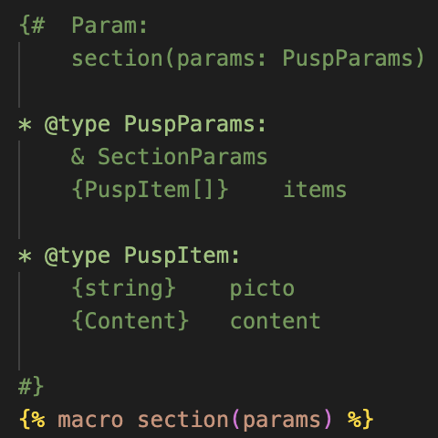
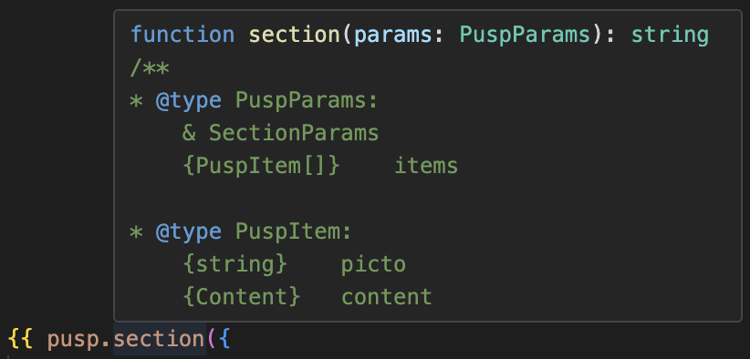
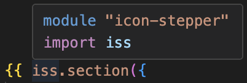
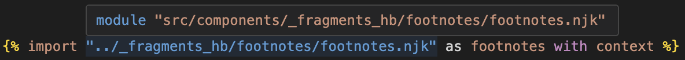
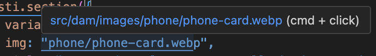

# Nunjucks BNPP Helper

> Improve the developer experience when working with Nunjucks templates.

This extension is designed for in-house use and is not published on the VS Code Marketplace.
As so, the implementation is fairly rudimentary and may result in some occasional bugs.

## Features Overview

- [Hover Informations](#hover-informations)
- [Go to Definition](#go-to-definition)
- [Auto Completion](#auto-completion)
- [Document Links](#document-links)
- [Command Palette](#command-palette)
- [Extension Settings](vscode://settings/)

## Installation

1. Download the ".vsix" file from the [latest release](https://github.com/honoredup/nunjucks-bnpp-helper/releases/latest) panel.
2. In vscode, in the command palette (`Cmd+Shift+P` / `Ctrl+Shift+P`), type: `Install from VSIX`.
3. Once installed, you will find the extension and its documentation in the Extension panel (`Cmd+Shift+X` / `Ctrl+Shift+X`)

## Requirements

The following extension must be installed: [Better Jinja](vscode:extension/samuelcolvin.jinjahtml).
During installation, vscode will prompt you to install it automatically.

## Release Notes

### 1.0.0

Initial version with basic implementation of Hover, Go to Definition, Auto completion and Document links.

---

# Features Documentation

## Hover Informations

The hover feature can be disabled in the extension [settings](vscode://settings/nunjucks-bnpp-helper.hover.enabled).

### Macro

Displays documentation extracted from the comment immediately above each macro definition.

<figure align="center">
  
  <figcaption>Legacy comments declaration example</figcaption>
</figure>

<figure align="center">
  
  <figcaption>Legacy comments hover example</figcaption>
</figure>

Legacy comments are comments that were written before this extension was created.
They always begin with “Param:” and are structured as shown in the example above.
These comments are rendered as typescript, and if “* @” is detected ; and this “/**” syntax is added to render the entire comment as a comment (for visual reasons).
You can use legacy comments if the entire comment is written in typescript.

### Imports

Displays the name of the module :

<figure align="center">
  
  <figcaption>Import object hover example</figcaption>
</figure>

Get detailed path of the import :

<figure align="center">
  
  <figcaption>Import path hover example</figcaption>
</figure>

## Go to Definition

- You can right click and `Go to Definition` or `Cmd+Click`/`Ctrl+Click` on :
    - A macro call → jumps to its definition.
    - An import object → jumps to its definition.
    - An import path → opens the imported Nunjucks file.
- Works across files and within included templates.

## Auto Completion

Autocompletion works only in nunjuck blocks.
It shows current import objects or all available macro.
On an import object it shows the available macro from that file.

## Document Links

The feature can be disabled in the extension [settings](vscode://settings/nunjucks-bnpp-helper.docLinks.enabled).

In a nunjuck file all file paths are automatically detected and fuzzy searched through the project.
If a file is found, vscode underlines it and you can `Cmd+Click`/`Ctrl+Click` to open it.

<figure align="center">
  
  <figcaption>Document link to an image</figcaption>
</figure>

You can also change [where to search](vscode://settings/nunjucks-bnpp-helper.docLinks.includePaths) and the folders to [exclude](vscode://settings/nunjucks-bnpp-helper.docLinks.excludePaths).

## Command Palette

To open the vscode Command Palette use `Cmd+Shift+P` / `Ctrl+Shift+P`.

Available commands are :

- **Restart**: In the case of any bug, try this command. It clears all extension caches and restarts file parsing.

